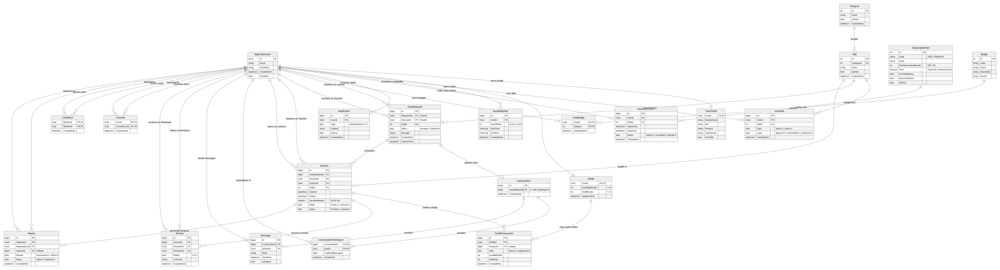

# SkillSwap Backend

> A peer-to-peer skill exchange and time-banking platform backend built with Clean Architecture, ASP.NET Core, and Entity Framework Core.

---

## What is SkillSwap?

SkillSwap lets users teach skills they know and learn skills from others using **time minutes** as currency (1 conceptual credit = 30 minutes). Teachers earn minutes; learners spend minutes. The platform coordinates skill discovery, dynamic matching, swap proposals, 1-on-1 conversations with real-time SignalR chat, session scheduling with escrow holds, post-session reviews, and tier-based learning quotas.

---

## Tech Stack

| Layer | Technology |
|---|---|
| Framework | .NET 10 / ASP.NET Core Web API |
| Language | C# 13 (nullable reference types, async/await) |
| Architecture | Clean Architecture (Domain, Application, Infrastructure, API, Tests) |
| ORM | Entity Framework Core 10 |
| Database | Microsoft SQL Server (Row-level `UPDLOCK, ROWLOCK` concurrency) |
| Identity | ASP.NET Core Identity (`IdentityUser<Guid>`) |
| Authentication | JWT Bearer Tokens |
| Real-Time Messaging | SignalR (`ChatHub`) |
| API Docs | Swagger / OpenAPI (Swashbuckle) |
| Testing | xUnit (Unit tests & SQL Server concurrency integration tests) |

---

## Project Status

- **Phase 1 -- Foundation:** Complete (Clean Architecture solution, DI, error middleware, health probes)
- **Phase 2 -- Database & Domain:** Complete (22 entities, 12 enums, EF configurations, initial migrations)
- **Phase 3 -- Core Business Engine:** Complete (Wallet balances, credit ledger, booking engine with deterministic row locking, quota evaluation inside transaction, double-completion protection, dispute & no-show handling)
- **Test Suite Health:** **74 passing tests**, 0 failures, 0 skipped, 0 build warnings.
- **Current Milestone:** Ready for parallel feature development on **Phase 4 (Auth & Profile)** and **Phase 5 (Skills, Availability & Matching)**.

---

## Database Schema & Entity Relationship Diagram (ERD)

The SkillSwap database schema contains **22 entities** modeling time-banking, peer exchanges, and user safety:

- **Complete ERD Specification & Catalog:** [`docs/ERD.md`](docs/ERD.md)
- **Standalone Vector Graphic:** [`docs/ERD.svg`](docs/ERD.svg)
- **Technical Entity Specifications (Source of Truth):** [`docs/DATABASE.md`](docs/DATABASE.md)

### Entity Relationship Diagram Preview



### Key Relational Highlights:
1. **Financial Core:** `ApplicationUser (1) <-> (1) Wallet (1) <-> (N) CreditTransaction <- (N) Session`. Balances (`AvailableMinutes`, `HeldMinutes`) cannot be negative. No direct Wallet-to-Session FK exists; all session transactions flow through the append-only `CreditTransaction` ledger.
2. **Swap Negotiation to Session:** `SwapRequest` (`RequesterId` = Learner, `ReceiverId` = Teacher) spawns a 1:1 `Conversation` and schedules one or more `Session` records.
3. **Multi-User Role Clarity:** `ApplicationUser` participates in explicit dual roles across `SwapRequest` (Learner vs Teacher), `Session` (Learner vs Teacher), `Review` (Reviewer vs Reviewee), `UserBlock` (Blocker vs Blocked), `Favorite`, and `Report`.

---

## Official Solution & Repository Structure

The official solution file is **`SkillSwap.sln`**. All developers must use `SkillSwap.sln`.

```text
SkillSwap/
|-- SkillSwap.sln              <- Official Visual Studio / dotnet solution
|-- README.md                  <- Project entry point
|-- .gitignore                 <- Git exclusion rules
|-- .github/                   <- GitHub templates (PR template)
|-- docs/                      <- Architectural & business specifications
|   |-- ERD.md                 <- Canonical Entity Relationship Diagram & catalog
|   |-- ERD.svg                <- Standalone vector graphic of the database ERD
|   |-- Business-Rules.md      <- Authoritative business rules
|   |-- DATABASE.md            <- Database & entity specification (Source of Truth)
|   |-- FINANCIAL-ENGINE.md    <- Financial concurrency & locking guarantees
|   |-- CONTRIBUTING.md        <- Contribution guidelines
|   `-- team/                  <- Official 5-Member Team Operating Manual
|       |-- README.md          <- Team documentation entry point & hierarchy
|       |-- TEAM-ARCHITECTURE.md <- Complete technical architecture & contract matrix
|       |-- TEAM-WORKFLOW.md   <- Git workflow, review rules, migration policy
|       |-- MEMBER-1-AUTH-PROFILE.md    <- Ownership guide: Member 1
|       |-- MEMBER-2-SKILLS-MATCHING.md  <- Ownership guide: Member 2
|       |-- MEMBER-3-SWAP-CHAT.md       <- Ownership guide: Member 3
|       |-- MEMBER-4-SESSION-WALLET.md  <- Ownership guide: Member 4 (Financial Lead)
|       `-- MEMBER-5-PLATFORM.md        <- Ownership guide: Member 5
|-- src/
|   |-- SkillSwap.Domain/          <- Core domain models, 22 entities, enums, exceptions
|   |-- SkillSwap.Application/     <- Use cases, DTOs, service abstractions (no Infra/API refs)
|   |-- SkillSwap.Infrastructure/  <- EF Core DbContext, Identity, locking, migrations
|   `-- SkillSwap.API/             <- REST Controllers, SignalR ChatHub, Program.cs
`-- tests/
    `-- SkillSwap.Tests/           <- xUnit unit tests & SQL Server concurrency tests
```

---

## Team Documentation

The complete backend team operating manual is located in [`docs/team/`](docs/team/). Every backend developer must read their assigned module guide before creating a branch:

| Document | Primary Audience | Scope |
|---|---|---|
| [docs/team/README.md](docs/team/README.md) | All Developers | Team onboarding, source-of-truth hierarchy, terminology guide |
| [docs/team/TEAM-ARCHITECTURE.md](docs/team/TEAM-ARCHITECTURE.md) | All Developers | 22 entities, cross-module contracts, API matrix, concurrency models |
| [docs/team/TEAM-WORKFLOW.md](docs/team/TEAM-WORKFLOW.md) | All Developers | GitFlow rules, PR checklist, sole-owner migration policy, 12 rules |
| [docs/team/MEMBER-1-AUTH-PROFILE.md](docs/team/MEMBER-1-AUTH-PROFILE.md) | **Member 1** | Identity, Registration, Login, JWT tokens, UserProfiles |
| [docs/team/MEMBER-2-SKILLS-MATCHING.md](docs/team/MEMBER-2-SKILLS-MATCHING.md) | **Member 2** | Categories, Skills catalog, UserSkills (Teach/Learn), Availability, Matching |
| [docs/team/MEMBER-3-SWAP-CHAT.md](docs/team/MEMBER-3-SWAP-CHAT.md) | **Member 3** | SwapRequest negotiation, Conversations, Messages, SignalR ChatHub |
| [docs/team/MEMBER-4-SESSION-WALLET.md](docs/team/MEMBER-4-SESSION-WALLET.md) | **Member 4** | Sessions, Wallets, CreditTransactions, background workers, **Migrations Lead** |
| [docs/team/MEMBER-5-PLATFORM.md](docs/team/MEMBER-5-PLATFORM.md) | **Member 5** | Reviews, Notifications, Badges, Favorites, Blocks, Reports, Subscriptions |

---

## Git Branching Model

The project follows a strict branching workflow:

- **`main`**: Production-ready, stable releases. Direct pushes are blocked.
- **`develop`**: Team integration trunk. All feature branches branch from and merge into `develop`.
- **Feature Branches**:
  - `feature/auth-profile` (Member 1)
  - `feature/skills-matching` (Member 2)
  - `feature/swap-chat` (Member 3)
  - `feature/session-wallet` (Member 4)
  - `feature/reviews-platform` (Member 5)

Developers create their feature branches from `develop`:
```bash
git checkout develop
git pull origin develop
git checkout -b feature/<your-feature-name>
```

---

## Database Migrations Policy

> **CRITICAL:** **Member 4 is the exclusive authority for EF Core migrations.**
> Independent execution of `dotnet ef migrations add` by other developers is prohibited.

Schema changes must be submitted as entity configurations under `src/SkillSwap.Infrastructure/Persistence/Configurations/` and coordinated with Member 4 via PR/issue.

---

## Getting Started

### Prerequisites

- [.NET 10 SDK](https://dotnet.microsoft.com/download)
- Microsoft SQL Server (Local, LocalDB, or Docker)

### Build Solution

```bash
dotnet restore SkillSwap.sln
dotnet build SkillSwap.sln
```

### Run Tests

Execute the full xUnit test suite (74 tests):

```bash
dotnet test SkillSwap.sln
```

### Database Setup

Configure your connection string in `src/SkillSwap.API/appsettings.Development.json` or use .NET User Secrets:

```bash
cd src/SkillSwap.API
dotnet user-secrets set "ConnectionStrings:DefaultConnection" "Server=localhost;Database=SkillSwapDb;Trusted_Connection=True;MultipleActiveResultSets=true;TrustServerCertificate=True;"
```

Apply existing migrations:

```bash
dotnet ef database update --project ../SkillSwap.Infrastructure --startup-project .
```

### Run the API

```bash
cd src/SkillSwap.API
dotnet run
```

Endpoints will be available at:
- Liveness Probe: `GET https://localhost:7xxx/api/health`
- Swagger UI: `https://localhost:7xxx/swagger`
- SignalR Chat Hub: `wss://localhost:7xxx/hubs/chat`

---
*SkillSwap Backend Engineering Team*
