# SkillSwap Database -- Entity Relationship Diagram (ERD)

This document provides the authoritative Entity Relationship Diagram (ERD) and relational catalog for the finalized SkillSwap database schema.

> **Source of Truth:**
> - [ApplicationDbContext.cs](../src/SkillSwap.Infrastructure/Persistence/ApplicationDbContext.cs)
> - [EF Core Entity Configurations](../src/SkillSwap.Infrastructure/Persistence/Configurations/)
> - [Domain Entities](../src/SkillSwap.Domain/Entities/)
> - [DATABASE.md](DATABASE.md)
>
> **Vector Graphic:** A rendered standalone vector diagram is available in [`docs/ERD.svg`](ERD.svg).

---

## 1. Canonical Mermaid Entity Relationship Diagram

```mermaid
erDiagram
    %% ==========================================
    %% User Identity & Profile Relationships
    %% ==========================================
    ApplicationUser ||--|| UserProfile : "owns profile"
    ApplicationUser ||--|| Wallet : "owns wallet"
    ApplicationUser ||--o{ UserSkill : "has skills"
    ApplicationUser ||--o{ AvailabilitySlot : "schedules availability"
    ApplicationUser ||--o{ UserSubscription : "holds subscription"
    ApplicationUser ||--o{ Notification : "receives alerts"
    ApplicationUser ||--o{ UserBadge : "earns badges"

    %% Multi-User Relationships from ApplicationUser
    ApplicationUser ||--o{ SwapRequest : "requests as Learner"
    ApplicationUser ||--o{ SwapRequest : "receives as Teacher"
    ApplicationUser ||--o{ Session : "teaches as Teacher"
    ApplicationUser ||--o{ Session : "learns as Learner"
    ApplicationUser ||--o{ ConversationParticipant : "participates in"
    ApplicationUser ||--o{ Message : "sends messages"
    ApplicationUser ||--o{ Review : "writes as Reviewer"
    ApplicationUser ||--o{ Review : "receives as Reviewee"
    ApplicationUser ||--o{ Favorite : "favorites users"
    ApplicationUser ||--o{ Favorite : "favorited by"
    ApplicationUser ||--o{ UserBlock : "blocks users"
    ApplicationUser ||--o{ UserBlock : "blocked by"
    ApplicationUser ||--o{ Report : "reports users"
    ApplicationUser ||--o{ Report : "reported as"

    %% ==========================================
    %% Skills & Catalog Hierarchy
    %% ==========================================
    Category ||--|{ Skill : "groups"
    Skill ||--o{ UserSkill : "categorizes"
    Skill ||--o{ SwapRequest : "requested in"
    Skill ||--o{ Session : "taught in"

    %% ==========================================
    %% Swap Request & Real-Time Chat
    %% ==========================================
    SwapRequest ||--o| Conversation : "spawns chat"
    SwapRequest ||--o{ Session : "schedules"
    Conversation ||--|{ ConversationParticipant : "includes"
    Conversation ||--o{ Message : "contains"

    %% ==========================================
    %% Financial Core & Session Execution
    %% ==========================================
    Wallet ||--o{ CreditTransaction : "logs audit entries"
    Session ||--o{ CreditTransaction : "settles credits"
    Session ||--o{ Review : "receives reviews"
    Session ||--o{ Report : "generates dispute"

    %% ==========================================
    %% Platform Subscriptions & Badges
    %% ==========================================
    SubscriptionPlan ||--o{ UserSubscription : "defines tier"
    Badge ||--o{ UserBadge : "awards"

    %% ==========================================
    %% Entity Definitions with Attributes
    %% ==========================================

    ApplicationUser {
        Guid Id PK
        string Email
        string UserName
        datetime2 CreatedAtUtc
        bool IsDeleted
    }

    UserProfile {
        Guid UserId PK,FK
        string DisplayName
        string Bio
        string PhotoUrl
        string TimeZoneId
        bool IsVerified
    }

    Category {
        int Id PK
        string Name
        bool IsActive
        datetime2 CreatedAtUtc
    }

    Skill {
        int Id PK
        int CategoryId FK
        string Name
        bool IsActive
        datetime2 CreatedAtUtc
    }

    UserSkill {
        bigint Id PK
        Guid UserId FK
        int SkillId FK
        byte Type "Teach=1, Learn=2"
        byte Level "Beginner=1, Intermediate=2, Advanced=3"
        datetime2 CreatedAtUtc
    }

    AvailabilitySlot {
        bigint Id PK
        Guid UserId FK
        int DayOfWeek "0=Sun..6=Sat"
        TimeOnly StartTime
        TimeOnly EndTime
        datetime2 CreatedAtUtc
    }

    SwapRequest {
        bigint Id PK
        Guid RequesterId FK "Learner"
        Guid ReceiverId FK "Teacher"
        int SkillId FK
        byte Status "Pending=1..Expired=5"
        string Message
        datetime2 CreatedAtUtc
        datetime2 ExpiresAtUtc
    }

    Conversation {
        bigint Id PK
        bigint SwapRequestId FK "1:1 with SwapRequest"
        datetime2 CreatedAtUtc
    }

    ConversationParticipant {
        bigint ConversationId PK,FK
        Guid UserId PK,FK
        bigint LastReadMessageId
        datetime2 JoinedAtUtc
    }

    Message {
        bigint Id PK
        bigint ConversationId FK
        Guid SenderId FK
        string Body
        datetime2 SentAtUtc
        bool IsDeleted
    }

    Session {
        bigint Id PK
        bigint SwapRequestId FK
        Guid TeacherId FK
        Guid LearnerId FK
        int SkillId FK
        datetime2 StartUtc
        datetime2 EndUtc
        smallint DurationMinutes "30, 60, 90"
        byte Mode "Online=1, InPerson=2"
        byte Status "Pending=1..Expired=7"
    }

    Wallet {
        Guid UserId PK,FK
        int AvailableMinutes ">= 0"
        int HeldMinutes ">= 0"
        datetime2 UpdatedAtUtc
    }

    CreditTransaction {
        bigint Id PK
        Guid WalletId FK
        bigint SessionId FK "nullable"
        byte Type "Bonus=1..Adjustment=6"
        int AvailableDelta
        int HeldDelta
        datetime2 CreatedAtUtc
    }

    Review {
        bigint Id PK
        bigint SessionId FK
        Guid ReviewerId FK
        Guid RevieweeId FK
        byte Rating "1 to 5"
        string Comment
        datetime2 CreatedAtUtc
    }

    SubscriptionPlan {
        int Id PK
        string Code "FREE, PREMIUM"
        string Name
        int MonthlyLearningMinutes "180, 720"
        decimal Price "Free=0.00, Premium=NULL"
        bool PriorityMatching
        bool AdvancedSearch
        bool IsActive
    }

    UserSubscription {
        bigint Id PK
        Guid UserId FK
        int PlanId FK
        datetime2 StartsAtUtc
        datetime2 EndsAtUtc
        byte Status "Active=1, Cancelled=2, Expired=3"
        datetime2 CreatedAtUtc
    }

    Notification {
        bigint Id PK
        Guid UserId FK
        byte Type "NotificationKind 1..8"
        string Payload
        bool IsRead
        datetime2 CreatedAtUtc
    }

    Badge {
        int Id PK
        string Code
        string Name
        string Description
        string IconUrl
    }

    UserBadge {
        Guid UserId PK,FK
        int BadgeId PK,FK
        datetime2 AwardedAtUtc
    }

    Favorite {
        Guid UserId PK,FK
        Guid FavoriteUserId PK,FK
        datetime2 CreatedAtUtc
    }

    UserBlock {
        Guid BlockerId PK,FK
        Guid BlockedId PK,FK
        datetime2 CreatedAtUtc
    }

    Report {
        bigint Id PK
        Guid ReporterId FK
        Guid ReportedUserId FK
        bigint SessionId FK "nullable"
        byte Reason "Harassment=1..Other=6"
        byte Status "Open=1..Rejected=4"
        datetime2 CreatedAtUtc
    }
```



---

## 2. Relational Schema Catalog (22 Entities)

The SkillSwap database comprises **22 distinct entities** engineered for high-concurrency time banking and peer-to-peer exchanges:

| # | Entity | Primary Key | Key Foreign Keys | Primary Business Attributes | Table Name |
|---|---|---|---|---|---|
| 1 | `ApplicationUser` | `Guid Id` | *(Self / ASP.NET Identity)* | `Email`, `UserName`, `IsDeleted` | `Users` |
| 2 | `UserProfile` | `Guid UserId` | `UserId -> Users` | `DisplayName`, `Bio`, `PhotoUrl`, `TimeZoneId`, `IsVerified` | `UserProfiles` |
| 3 | `Category` | `int Id` | *(None)* | `Name` (Unique), `IsActive` | `Categories` |
| 4 | `Skill` | `int Id` | `CategoryId -> Categories` | `Name` (Unique per Category), `IsActive` | `Skills` |
| 5 | `UserSkill` | `bigint Id` | `UserId -> Users`, `SkillId -> Skills` | `Type` (Teach/Learn), `Level` (1..3) | `UserSkills` |
| 6 | `AvailabilitySlot` | `bigint Id` | `UserId -> Users` | `DayOfWeek`, `StartTime`, `EndTime` | `AvailabilitySlots` |
| 7 | `SwapRequest` | `bigint Id` | `RequesterId -> Users`, `ReceiverId -> Users`, `SkillId -> Skills` | `Status` (Pending..Expired), `Message` | `SwapRequests` |
| 8 | `Conversation` | `bigint Id` | `SwapRequestId -> SwapRequests` (Unique) | `CreatedAtUtc` | `Conversations` |
| 9 | `ConversationParticipant` | `(ConversationId, UserId)` | `ConversationId -> Conversations`, `UserId -> Users` | `LastReadMessageId`, `JoinedAtUtc` | `ConversationParticipants` |
| 10 | `Message` | `bigint Id` | `ConversationId -> Conversations`, `SenderId -> Users` | `Body`, `SentAtUtc`, `IsDeleted` | `Messages` |
| 11 | `Session` | `bigint Id` | `SwapRequestId -> SwapRequests`, `TeacherId -> Users`, `LearnerId -> Users`, `SkillId -> Skills` | `StartUtc`, `EndUtc`, `DurationMinutes` (30/60/90), `Status` | `Sessions` |
| 12 | `Wallet` | `Guid UserId` | `UserId -> Users` | `AvailableMinutes` (>=0), `HeldMinutes` (>=0) | `Wallets` |
| 13 | `CreditTransaction` | `bigint Id` | `WalletId -> Wallets`, `SessionId -> Sessions` (nullable) | `Type` (Hold/Release/Capture/Earn), `AvailableDelta`, `HeldDelta` | `CreditTransactions` |
| 14 | `Review` | `bigint Id` | `SessionId -> Sessions`, `ReviewerId -> Users`, `RevieweeId -> Users` | `Rating` (1..5), `Comment` | `Reviews` |
| 15 | `SubscriptionPlan` | `int Id` | *(None)* | `Code`, `Name`, `MonthlyLearningMinutes` (180/720), `Price` (NULL for Premium) | `SubscriptionPlans` |
| 16 | `UserSubscription` | `bigint Id` | `UserId -> Users`, `PlanId -> SubscriptionPlans` | `Status` (Active..Expired), `StartsAtUtc`, `EndsAtUtc` | `UserSubscriptions` |
| 17 | `Notification` | `bigint Id` | `UserId -> Users` | `Type` (Kind 1..8), `Payload`, `IsRead` | `Notifications` |
| 18 | `Badge` | `int Id` | *(None)* | `Code`, `Name`, `Description`, `IconUrl` | `Badges` |
| 19 | `UserBadge` | `(UserId, BadgeId)` | `UserId -> Users`, `BadgeId -> Badges` | `AwardedAtUtc` | `UserBadges` |
| 20 | `Favorite` | `(UserId, FavoriteUserId)` | `UserId -> Users`, `FavoriteUserId -> Users` | `CreatedAtUtc` | `Favorites` |
| 21 | `UserBlock` | `(BlockerId, BlockedId)` | `BlockerId -> Users`, `BlockedId -> Users` | `CreatedAtUtc` | `UserBlocks` |
| 22 | `Report` | `bigint Id` | `ReporterId -> Users`, `ReportedUserId -> Users`, `SessionId -> Sessions` | `Reason`, `Description`, `Status` | `Reports` |

---

## 3. Special Multi-User Foreign Key Roles

Because SkillSwap is a peer-to-peer exchange, `ApplicationUser` participates in multiple distinct roles across key entities:

### 1. `SwapRequest`
- **`RequesterId -> Users.Id`**: The **Learner** who initiates the request seeking knowledge.
- **`ReceiverId -> Users.Id`**: The **Teacher** who receives the proposal to teach their skill.
- *Invariant:* `RequesterId != ReceiverId`.

### 2. `Session`
- **`LearnerId -> Users.Id`**: Spends minutes held in escrow; mapped strictly from `SwapRequest.RequesterId`.
- **`TeacherId -> Users.Id`**: Earns minutes upon completion; mapped strictly from `SwapRequest.ReceiverId`.
- **`CancelledById -> Users.Id`** *(Nullable)*: Participant who initiated cancellation.
- **`NoShowUserId -> Users.Id`** *(Nullable)*: Participant marked absent.
- **`ReportedById -> Users.Id`** *(Nullable)*: Participant who reported a dispute.

### 3. `Review`
- **`ReviewerId -> Users.Id`**: Participant submitting feedback (Learner or Teacher).
- **`RevieweeId -> Users.Id`**: Counterparty receiving the rating.

### 4. `Favorite`
- **`UserId -> Users.Id`**: The user bookmarking another profile.
- **`FavoriteUserId -> Users.Id`**: The target bookmarked user.

### 5. `UserBlock`
- **`BlockerId -> Users.Id`**: The user initiating communication/swap blockage.
- **`BlockedId -> Users.Id`**: The blocked counterparty.

### 6. `Report`
- **`ReporterId -> Users.Id`**: Complainant filing the moderation issue.
- **`ReportedUserId -> Users.Id`**: Accused user under review.

---

## 4. Key Functional Relational Clusters

### A. The Financial Core
```text
ApplicationUser (1) ?? (1) Wallet (1) ?? (N) CreditTransaction
                                                  ?
Session (1) ??????????????????????????????????????? (Settles credit deltas)
```
- A user owns exactly one `Wallet`.
- `CreditTransaction` is an immutable, append-only ledger entry recording balance deltas (`Hold`, `Release`, `Capture`, `Earn`).
- **No direct Wallet-to-Session foreign key exists.** All session financial operations link through `CreditTransaction.SessionId`.

### B. Swap Negotiation to Session Execution Flow
```text
ApplicationUser
      ?
      ?
SwapRequest (Requester = Learner, Receiver = Teacher)
      ?
      ??? (1:1) ??> Conversation ?? (1:N) ??> Message
      ?
      ??? (1:N) ??> Session ????? (1:N) ??> CreditTransaction (Settlement)
                              ??? (1:N) ??> Review (Feedback)
```
- Accepting a `SwapRequest` spawns a 1:1 `Conversation`.
- An accepted `SwapRequest` serves as the authorization parent for scheduling one or many `Session` records.
- Completed sessions generate `Review` entries and complete credit settlement.

---

## 5. Referential Integrity & Cascade Safeguards

To prevent SQL Server multiple cascade path exceptions (`CYCLE` or `MULTIPLE CASCADE PATHS`) and protect historical audit trails:
- **`DeleteBehavior.Restrict` or `NoAction`** is enforced across all financial and session foreign keys (`CreditTransaction`, `Session`, `SwapRequest`, `Review`, `Report`).
- **Financial Immutability:** Financial rows are never physically deleted.
- **Soft Deletes:** Account deactivation utilizes `ApplicationUser.IsDeleted` rather than database-level cascades.

---
*SkillSwap Database Architecture Board -- Official ERD Specification*
