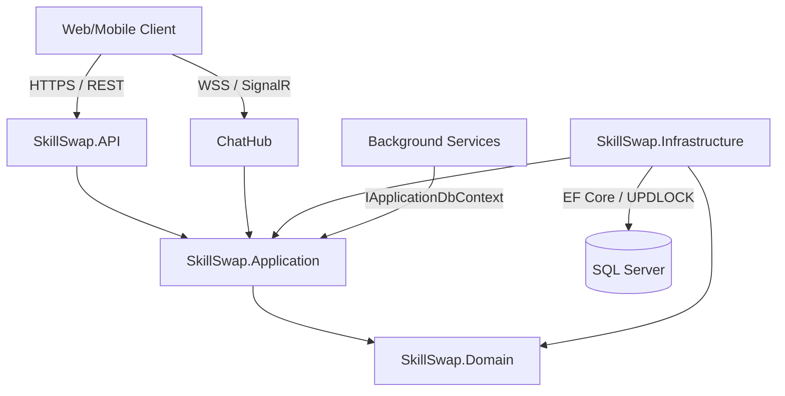
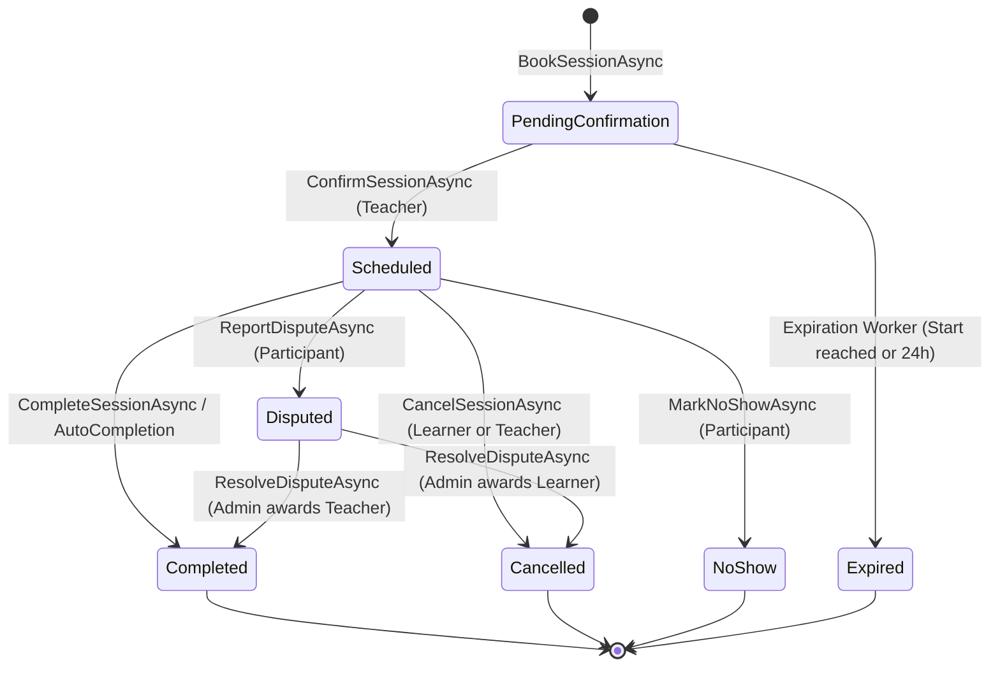
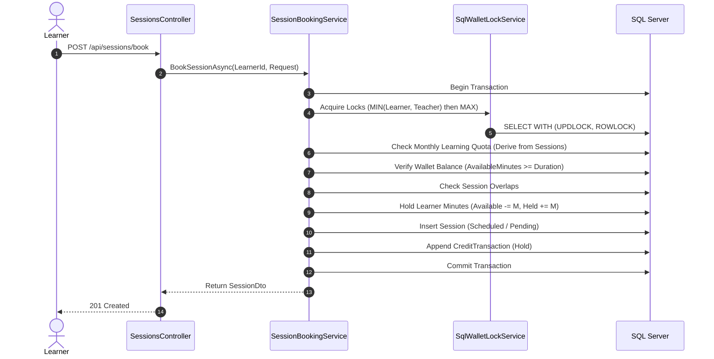

# SkillSwap Backend -- Team Architecture Specification

This document serves as the master architectural blueprint and technical contract for the SkillSwap backend. All 5 developers must design and implement code according to the boundaries, matrices, and invariants defined herein.

---

## Table of Contents
1. [System Overview](#1-system-overview)
2. [Architecture Layers & Dependency Rules](#2-architecture-layers--dependency-rules)
3. [Project Dependency Map](#3-project-dependency-map)
4. [Domain Ownership Matrix (22 Entities)](#4-domain-ownership-matrix-22-entities)
5. [Module Ownership Breakdown](#5-module-ownership-breakdown)
6. [Ownership vs Execution Phases](#6-ownership-vs-execution-phases)
7. [Shared Infrastructure Ownership](#7-shared-infrastructure-ownership)
8. [Database Ownership & Migration Rules](#8-database-ownership--migration-rules)
9. [Cross-Module Business Contracts](#9-cross-module-business-contracts)
10. [API Ownership Matrix](#10-api-ownership-matrix)
11. [Shared File Rules](#11-shared-file-rules)
12. [Authentication & Authorization Boundaries](#12-authentication--authorization-boundaries)
13. [Financial & Transactional Boundary](#13-financial--transactional-boundary)
14. [SignalR & Real-Time Boundary](#14-signalr--real-time-boundary)
15. [Subscription & Quota Boundary](#15-subscription--quota-boundary)
16. [Testing Boundaries & Quality Gates](#16-testing-boundaries--quality-gates)
17. [Official Project Execution Roadmap (Phases 1-9)](#17-official-project-execution-roadmap-phases-1-9)
18. [Contract Change-Management Rules](#18-contract-change-management-rules)
19. [Known Deferred Items (Non-MVP Scope)](#19-known-deferred-items-non-mvp-scope)
20. [Terminology Disambiguation Guide](#20-terminology-disambiguation-guide)
21. [Architectural & Lifecycle Diagrams](#21-architectural--lifecycle-diagrams)

---

## 1. System Overview

SkillSwap is a peer-to-peer time-banking platform where users exchange skills without fiat money. The fundamental currency of the platform is **time minutes**:
- **1 conceptual credit = 30 minutes**.
- All ledger and balance values are stored strictly as **integer minutes**.
- When a user learns a skill, their time minutes are held in escrow and transferred to the teacher upon verified session completion.
- When a user teaches a skill, they earn time minutes that can later be spent learning other skills.

The backend is organized as a modular Clean Architecture solution using .NET 10, C# 13, Entity Framework Core, SQL Server, and ASP.NET Core Web API with SignalR.

---

## 2. Architecture Layers & Dependency Rules

The solution strictly enforces Clean Architecture dependency boundaries with precise technical definitions:

```
+--------------------------------------------------------+
|                   SkillSwap.API                        |
|   (Controllers, Hubs, Middlewares, Program.cs)         |
+--------------------------+-----------------------------+
                           | references
                           v
+--------------------------------------------------------+
|              SkillSwap.Infrastructure                  |
|   (EF Core, SqlServer, Identity, Background Jobs, DI)  |
+--------------------------+-----------------------------+
                           | references
                           v
+--------------------------------------------------------+
|               SkillSwap.Application                    |
|   (Use Cases, Services, DTOs, Abstractions)            |
+--------------------------+-----------------------------+
                           | references
                           v
+--------------------------------------------------------+
|                  SkillSwap.Domain                      |
|   (Entities, Value Objects, Enums, Exceptions)         |
+--------------------------------------------------------+
```

### Layer Responsibilities & Strict Rules

1. **`SkillSwap.Domain`** (`src/SkillSwap.Domain`):
   - Contains core domain models, enterprise entities, value objects, domain enums, and domain exceptions.
   - **Zero external dependencies**: Contains only pure C# constructs. Never reference EF Core, ASP.NET Core, or third-party packages here.
2. **`SkillSwap.Application`** (`src/SkillSwap.Application`):
   - Contains application use cases, orchestration services (`SessionBookingService`, `WalletService`, `SessionCompletionService`, etc.), and DTO contracts.
   - **Owns application contracts and abstractions** (`IApplicationDbContext`, `IWalletService`, `ISessionService`, etc.) implemented by Infrastructure.
   - **Strict Dependency Rules:**
     - `SkillSwap.Application` **MUST NOT depend on `SkillSwap.Infrastructure` or `SkillSwap.API`**.
     - References `SkillSwap.Domain` and framework database abstractions (`Microsoft.EntityFrameworkCore` for `DbSet<T>` abstractions in `IApplicationDbContext` and `Microsoft.Extensions.Options`) without referencing SQL Server, migrations, or persistence implementations.
3. **`SkillSwap.Infrastructure`** (`src/SkillSwap.Infrastructure`):
   - Implements persistence (`ApplicationDbContext`, EF Core Configurations), SQL Server migrations and locking, ASP.NET Core Identity integration (`ApplicationUser`), background hosted services, and token generation.
   - Depends on `SkillSwap.Application` and `SkillSwap.Domain`.
4. **`SkillSwap.API`** (`src/SkillSwap.API`):
   - Presentation layer: REST API Controllers (`SessionsController`, `WalletsController`, `AdminSessionsController`, `HealthController`), SignalR `ChatHub`, Global Exception Handling Middleware, and Swagger/OpenAPI extensions.
   - **Delegates all business behavior to Application services.** Controllers are thin HTTP dispatchers.
5. **`SkillSwap.Tests`** (`tests/SkillSwap.Tests`):
   - Contains unit and integration tests verifying domain models, business service contracts, and concurrent SQL Server locking behavior.

---

## 3. Project Dependency Map

```
SkillSwap.Domain (Core domain models & business concepts -- Standalone)
       ^
       |
SkillSwap.Application (Application contracts, use cases, DTOs -- No Infra or API dependency)
       ^
       +---------------------------------+
       |                                 |
SkillSwap.Infrastructure (Persistence, SQL Server, Identity, Background Workers)
       ^                                 |
       |                                 |
SkillSwap.API (Presentation layer -- Delegates behavior to Application)
       ^
       |
SkillSwap.Tests (References API, Infrastructure, Application, Domain)
```

### Boundary Constraints:
- `SkillSwap.Domain` contains core domain models and business concepts, and MUST NEVER reference any other project.
- `SkillSwap.Application` MUST NOT depend on `SkillSwap.Infrastructure` or `SkillSwap.API`.
- `SkillSwap.Application` owns application contracts/abstractions used by Infrastructure implementations.
- `SkillSwap.Infrastructure` implements persistence, Identity, SQL Server, background services, and other infrastructure concerns.
- `SkillSwap.API` is the presentation layer and delegates all business behavior to Application services.

---

## 4. Domain Ownership Matrix (22 Entities)

The domain model contains **22 entities**, 12 enums, and 7 specialized domain exceptions. Ownership is partitioned across the 5 backend developers:

### Entity Ownership Table

| # | Entity | Primary Key Type | Owning Module | Lead Developer | Primary Table Name |
|---|---|---|---|---|---|
| 1 | `ApplicationUser` | `Guid` | Auth & Profile | Member 1 | `Users` |
| 2 | `UserProfile` | `Guid` | Auth & Profile | Member 1 | `UserProfiles` |
| 3 | `Category` | `int` | Skills & Matching | Member 2 | `Categories` |
| 4 | `Skill` | `int` | Skills & Matching | Member 2 | `Skills` |
| 5 | `UserSkill` | `long` | Skills & Matching | Member 2 | `UserSkills` |
| 6 | `AvailabilitySlot` | `long` | Skills & Matching | Member 2 | `AvailabilitySlots` |
| 7 | `SwapRequest` | `long` | Swap & Chat | Member 3 | `SwapRequests` |
| 8 | `Conversation` | `long` | Swap & Chat | Member 3 | `Conversations` |
| 9 | `ConversationParticipant` | `(long, Guid)` | Swap & Chat | Member 3 | `ConversationParticipants` |
| 10 | `Message` | `long` | Swap & Chat | Member 3 | `Messages` |
| 11 | `Session` | `long` | Session & Wallet | Member 4 | `Sessions` |
| 12 | `Wallet` | `Guid` | Session & Wallet | Member 4 | `Wallets` |
| 13 | `CreditTransaction` | `long` | Session & Wallet | Member 4 | `CreditTransactions` |
| 14 | `Review` | `long` | Platform Features | Member 5 | `Reviews` |
| 15 | `SubscriptionPlan` | `int` | Platform Features | Member 5 | `SubscriptionPlans` |
| 16 | `UserSubscription` | `long` | Platform Features | Member 5 | `UserSubscriptions` |
| 17 | `Notification` | `long` | Platform Features | Member 5 | `Notifications` |
| 18 | `Badge` | `int` | Platform Features | Member 5 | `Badges` |
| 19 | `UserBadge` | `(Guid, int)` | Platform Features | Member 5 | `UserBadges` |
| 20 | `Favorite` | `(Guid, Guid)` | Platform Features | Member 5 | `Favorites` |
| 21 | `UserBlock` | `(Guid, Guid)` | Platform Features | Member 5 | `UserBlocks` |
| 22 | `Report` | `long` | Platform Features | Member 5 | `Reports` |

### Enum Ownership Table

| Enum | Underlying Type | Values / Meanings | Owning Module |
|---|---|---|---|
| `CreditTransactionType` | `byte` | Bonus(1), Hold(2), Release(3), Capture(4), Earn(5), Adjustment(6) | Member 4 |
| `NoShowParty` | `byte` | Learner(1), Teacher(2), Both(3) | Member 4 |
| `NotificationKind` | `byte` | SwapRequest(1), SessionReminder(2), SessionCompleted(3), SessionCancelled(4), NewMessage(5), ReviewReceived(6), BadgeEarned(7), System(8) | Member 5 |
| `ReportReason` | `byte` | Harassment(1), InappropriateContent(2), Spam(3), NoShow(4), Fraud(5), Other(6) | Member 5 |
| `ReportStatus` | `byte` | Open(1), UnderReview(2), Resolved(3), Rejected(4) | Member 5 |
| `SessionMode` | `byte` | Online(1), InPerson(2) | Member 4 |
| `SessionStatus` | `byte` | PendingConfirmation(1), Scheduled(2), Completed(3), Cancelled(4), NoShow(5), Disputed(6), Expired(7) | Member 4 |
| `SubscriptionPlanType` | `int` | Free(1), Premium(2) | Member 5 |
| `SubscriptionStatus` | `byte` | Active(1), Cancelled(2), Expired(3) | Member 5 |
| `SwapRequestStatus` | `byte` | Pending(1), Accepted(2), Declined(3), Cancelled(4), Expired(5) | Member 3 |
| `UserSkillLevel` | `byte` | Beginner(1), Intermediate(2), Advanced(3) | Member 2 |
| `UserSkillType` | `byte` | Teach(1), Learn(2) [Aliases: Teaching=1, Learning=2] | Member 2 |

### Domain Exceptions Matrix

All domain exceptions inherit from `DomainException` (`src/SkillSwap.Domain/Exceptions/DomainException.cs`):
- `InsufficientBalanceException`: Thrown when available minutes are insufficient for hold. (Owner: Member 4)
- `InvalidSessionStateException`: Thrown on illegal session state transitions. (Owner: Member 4)
- `NotFoundException`: Generic entity not found exception. (Shared)
- `QuotaExceededException`: Thrown when monthly learning minutes exceed plan cap. (Owner: Member 4)
- `SessionOverlapException`: Thrown when a participant has a time collision. (Owner: Member 4)
- `UnauthorizedSessionAccessException`: Thrown when an unauthenticated or unrelated user attempts session operations. (Owner: Member 4)

---

## 5. Module Ownership Breakdown

### Module 1: Auth & Profile (Member 1)
- **Scope:** User registration, password security, login, JWT token issuance, ASP.NET Core Identity integration, user roles, profile management, and current user context.
- **Invariants:** 
  - Passwords must comply with enterprise identity rules (min 8 chars, digit, uppercase, lowercase, special char).
  - Each registered user must have an active `UserProfile` created.
  - New user registration must initialize a default `Wallet` (via Member 4 contract) and a default `UserSubscription` with the Free plan (via Member 5 contract).
- **Prohibited:** Must not modify financial engines, wallet ledgers, swap negotiations, or session booking.

### Module 2: Skills, Availability & Matching (Member 2)
- **Scope:** Category taxonomy, master skill definitions, user skill associations (`UserSkill` with `Type = Teach` or `Type = Learn`), recurring weekly availability slots (`AvailabilitySlot`), skill search, and computed matching algorithm.
- **Invariants:**
  - `Skill.Name` must be unique per `CategoryId`.
  - A user cannot teach and learn the same skill with duplicate rows.
  - **Matching is strictly computed dynamically**. There is **no persisted Match entity**. Recommendations are generated via query algorithms.
- **Prohibited:** Must not manage SwapRequest lifecycles, real-time messaging, or session scheduling.

### Module 3: Swap Request & Chat (Member 3)
- **Scope:** Peer swap request lifecycle (`Pending` -> `Accepted`, `Declined`, `Cancelled`, `Expired`), 1-on-1 conversations (`Conversation`), participants, messages, and real-time chat via SignalR (`ChatHub`).
- **Invariants:**
  - **Strict Role Contract:** `SwapRequest.RequesterId = Learner`, `SwapRequest.ReceiverId = Teacher`. Never invert these roles.
  - `SwapRequest.SkillId` is the skill the Requester wants to learn.
  - The SwapRequest never transitions to `Completed`. It remains `Accepted` and can spawn one or multiple sessions.
  - Accepting a SwapRequest automatically provisions a `Conversation` between Requester and Receiver.
- **Prohibited:** Must not touch wallet balances, hold/release escrow, or book sessions.

### Module 4: Session & Wallet -- Financial Lead (Member 4)
- **Scope:** Core financial engine, wallet balances, escrow hold/capture/release, session booking and lifecycle execution, concurrency control, monthly learning quota enforcement, no-show arbitration, dispute backend, background workers, and **single ownership of database migrations**.
- **Invariants:**
  - Wallet balances (`AvailableMinutes`, `HeldMinutes`) can never be negative.
  - Escrow bookings, completions, cancellations, and no-shows must update Wallet and CreditTransaction in the same transaction.
  - Quota is evaluated strictly after deterministic row locks (`UPDLOCK, ROWLOCK`) on wallets ordered by `UserId`.
  - Double completion is prevented by conditional SQL execution: `UPDATE Sessions SET Status = Completed WHERE Status = Scheduled`.
  - Deletions are forbidden on financial records (`DeleteBehavior.Restrict`).
- **Prohibited:** Must not implement public profile or category CRUD APIs.

### Module 5: Platform Features (Member 5)
- **Scope:** Session reviews and dynamic ratings, notifications (`Notification`), gamification badges (`Badge`, `UserBadge`), user favorites (`Favorite`), user blocking (`UserBlock`), moderation reporting (`Report`), and subscription capability tiers (`SubscriptionPlan`, `UserSubscription`).
- **Invariants:**
  - Reviews can only be submitted for sessions with `Status = Completed` by actual participants.
  - Blocked users cannot send swap requests to each other.
  - **Monetization Invariant:** Subscription pricing is unresolved in MVP. `SubscriptionPlan.Price` is `NULL` for Premium, `0.00` for Free. No real payment gateway integration in MVP.
- **Prohibited:** Must not modify core session booking, wallet balances, or credit ledgers.

---

## 6. Ownership vs Execution Phases

A critical distinction in this project is the difference between **Ownership** and **Execution Phases**:

```
+-------------------------------------------------------------+
|                        OWNERSHIP                            |
|             "Who owns this code / module?"                  |
|  - Assigned to a specific Team Member (Member 1 to 5).      |
|  - Defines code review rights, PR merge approvals, and      |
|    functional accountability.                               |
|  - Endures across all phases of the project lifecycle.      |
+-------------------------------------------------------------+
                              VS
+-------------------------------------------------------------+
|                     EXECUTION PHASES                        |
|   "When is this part of the project implemented & built?"   |
|  - Sequential roadmap milestones (Phases 1 through 9).      |
|  - Governs development order, integration gates, and CI.    |
|  - A single member's module can span multiple phases.       |
|  - Never implies a strict 1-to-1 mapping (e.g. Member 1 !=  |
|    Phase 4 exclusively).                                    |
+-------------------------------------------------------------+
```

### Key Principles:
1. **Ownership is Permanent:** Member 4 permanently owns the financial engine and database migrations; Member 1 permanently owns Identity and UserProfile.
2. **Phases are Milestones:** Phase 3 completed the core booking engine (led by Member 4). Phase 4 delivers Auth & Profile (primarily Member 1), while Phase 5 delivers Skills & Matching (primarily Member 2).
3. **Parallel Execution:** Phases 4 and 5 proceed in parallel because their underlying domain entities and business operations are decoupled.
4. **Cross-Phase Collaboration:** Later phases (such as Phase 8: Integration & Hardening) involve all 5 members working jointly across modules.

---

## 7. Shared Infrastructure Ownership

The following infrastructure components are shared across multiple modules. To prevent regressions, ownership and access rules are defined as follows:

| Shared Component | Location | Technical Owner | Who May Edit | Review Requirement |
|---|---|---|---|---|
| `ApplicationDbContext` | `src/.../Persistence/ApplicationDbContext.cs` | Member 4 | Member 4 (Others submit Configurations) | Required approval from Member 4 |
| `Program.cs` | `src/SkillSwap.API/Program.cs` | Member 4 / Team Lead | Any member adding middleware or route mapping | Architecture review required |
| `DependencyInjection.cs` | `src/.../DependencyInjection.cs` | Member 4 | Any member adding DI service registrations | Scoped module blocks only |
| `appsettings.json` | `src/SkillSwap.API/appsettings.json` | Member 1 & 4 | Member 1 (Auth), Member 4 (DB/Policy) | No hardcoded secrets |
| `EF Core Migrations` | `src/.../Migrations/` | **Member 4 ONLY** | **NO OTHER MEMBER MAY EDIT OR ADD** | Strict single-owner gate |
| `CurrentUserService` | `src/.../Services/CurrentUserService.cs` | Member 1 | Member 1 | Consumed by all via `ICurrentUserService` |
| `GlobalExceptionHandlingMiddleware` | `src/SkillSwap.API/Middleware/` | Team Lead | Team Lead | Modifying status code mappings requires review |

---

## 8. Database Ownership & Migration Rules

1. **Sole Migration Authority:**
   - **Member 4 is the exclusive owner of EF Core migrations.**
   - Independent execution of `dotnet ef migrations add` by any other developer is strictly prohibited.
2. **Schema Update Protocol for Members 1, 2, 3, and 5:**
   - **Step 1:** Modify your entity in `src/SkillSwap.Domain/Entities/`.
   - **Step 2:** Create or update your entity configuration in `src/SkillSwap.Infrastructure/Persistence/Configurations/` implementing `IEntityTypeConfiguration<T>`.
   - **Step 3:** Coordinate with Member 4 by opening an issue or PR for the schema change.
   - **Step 4:** Member 4 verifies navigation properties, cascade behaviors (`DeleteBehavior.Restrict`), indexes, and executes `dotnet ef migrations add <DescriptiveName>`.
   - **Step 5:** Member 4 runs integration tests and merges the migration into `develop`.
3. **Database Consistency Invariants:**
   - All primary keys use `Guid` for users/wallets and `int`/`bigint` identities for relational tables.
   - All datetime columns must be named with suffix `*Utc` and mapped to `datetime2`.
   - Recurring availability slots map to SQL Server `time` via .NET `TimeOnly`.
   - Hard deletes on financial and session records are strictly forbidden (`DeleteBehavior.Restrict` or `DeleteBehavior.NoAction`).

---

## 9. Cross-Module Business Contracts

These 34 business rules are finalized and non-negotiable:

1. **Time Platform Currency:** Time is platform currency. Stored values are integer minutes.
2. **Conceptual Credit Exchange:** 1 credit = 30 minutes; 2 credits = 60 minutes; 3 credits = 90 minutes.
3. **Integer Storage:** No floating-point or decimal minutes exist in wallet or ledger records.
4. **Wallet Balance Structure:** Wallet contains `AvailableMinutes` and `HeldMinutes`.
5. **Non-Negative Invariant:** `AvailableMinutes >= 0` and `HeldMinutes >= 0` at all times.
6. **Booking Escrow Hold:** Booking a session moves minutes: `AvailableMinutes -= duration`, `HeldMinutes += duration`.
7. **Session Completion Transfer:** Learner `HeldMinutes -= duration`; Teacher `AvailableMinutes += duration`. 1:1 transfer. Zero platform fee in MVP.
8. **Cancellation Policy:** Cancelling a session releases the hold: Learner `HeldMinutes -= duration`, `AvailableMinutes += duration`. No credit penalties in MVP.
9. **Learner No-Show:** Learner held minutes are captured (`Capture`); Teacher receives minutes (`Earn`). Learner monthly quota remains consumed.
10. **Teacher No-Show:** Learner held minutes are released (`Release`). Teacher receives nothing. Learner quota is freed.
11. **Both No-Show:** Learner held minutes are released (`Release`). No teacher payment.
12. **Disputed Session:** Status transitions to `Disputed`. Escrowed credits remain frozen. Admin-only arbitration.
13. **Allowed Session Durations:** Strictly 30, 60, or 90 minutes. `InProgress` is derived dynamically from time (`StartUtc <= UtcNow <= EndUtc`), never stored.
14. **Monthly Learning Quota:** Free = 180 min/month; Premium = 720 min/month. Teaching is uncapped. Derived dynamically from sessions based on `Session.StartUtc`. Evaluated inside transactional wallet lock.
15. **Computed Matching:** Matching recommendations are computed dynamically. No persisted `Match` entity.
16. **SwapRequest Statuses:** `Pending`, `Accepted`, `Declined`, `Cancelled`, `Expired`. There is NO `Completed` status.
17. **Strict Role Contract:** `SwapRequest.RequesterId = Learner`, `SwapRequest.ReceiverId = Teacher`. Never invert these roles.
18. **Session Mapping Integrity:** `Session.LearnerId = SwapRequest.RequesterId`, `Session.TeacherId = SwapRequest.ReceiverId`, `Session.SkillId = SwapRequest.SkillId`.
19. **Teacher Qualification:** Receiver/Teacher must actively teach the requested skill (`UserSkill.Type = Teach`).
20. **Skill Parity:** `Session.SkillId` must strictly equal `SwapRequest.SkillId`.
21. **Session Mode:** `Online` supported in MVP. `InPerson` is future-ready.
22. **Pending Session Expiration:** Session in `PendingConfirmation` expires at the earlier of: `CreatedAtUtc + PendingConfirmationHours` OR `StartUtc <= UtcNow`.
23. **Automatic Completion:** Background worker auto-completes sessions when `EndUtc + AutoCompletionGracePeriodMinutes <= UtcNow`, regardless of whether participants clicked "Join".
24. **Manual Completion:** Explicit participant-driven action requiring authenticated identity of Teacher or Learner.
25. **Auto-Completion Separation:** Internal system operation executing without an HTTP caller context.
26. **No-Show Reporting Authorization:** Only session participants may report no-show. Learner can only report Teacher; Teacher can only report Learner; participants cannot report themselves or report "Both". Admin/system can mark "Both".
27. **Dispute Resolution Administrative Boundary:** Strictly restricted to platform administrators (`[Authorize(Roles = "Admin")]`). Self-arbitration by participants is strictly rejected.
28. **Financial Immutability:** Financial, wallet, session, and ledger records must never be physically deleted.
29. **Transactional Idempotency:** Wallet and credit ledger mutations must execute atomically within a database transaction.
30. **Deterministic Concurrency Control:** Concurrency is protected via SQL Server row-level locking (`UPDLOCK, ROWLOCK`) in deterministic `UserId` order: `MIN(LearnerId, TeacherId)` followed by `MAX(LearnerId, TeacherId)`.
31. **No Payment Gateway in MVP:** Real monetary payments, Stripe, and credit card processing are completely out of MVP scope.
32. **Subscription Pricing Status:** Free = `0.00`; Premium = `NULL`. Pricing is unresolved.
33. **UTC Timestamps:** All datetime fields must be stored in UTC (`datetime2`).
34. **MVP Scope Boundaries:** No Redis, no microservices, no Kafka, no AI matching in MVP.

---

## 10. API Ownership Matrix

This table provides the definitive ownership and status of all backend endpoints:

| Endpoint Area | Method | Route | Purpose | Owner | Auth? | Role Req. | Status |
|---|---|---|---|---|---|---|---|
| **Health** | GET | `/api/health` | Service liveness probe | Shared | No | Anonymous | **IMPLEMENTED** |
| **Wallets** | GET | `/api/wallets/me` | Fetch caller's wallet balances | Member 4 | Yes | Authenticated | **IMPLEMENTED** |
| **Wallets** | GET | `/api/wallets/me/transactions` | Query wallet ledger audit trail | Member 4 | Yes | Authenticated | **IMPLEMENTED** |
| **Wallets** | GET | `/api/wallets/me/quota` | Query monthly learning quota status | Member 4 | Yes | Authenticated | **IMPLEMENTED** |
| **Sessions** | POST | `/api/sessions/book` | Book session and hold minutes in escrow | Member 4 | Yes | Authenticated | **IMPLEMENTED** |
| **Sessions** | GET | `/api/sessions/{id}` | Get session details by ID | Member 4 | Yes | Authenticated | **IMPLEMENTED** |
| **Sessions** | GET | `/api/sessions` | List sessions for current user | Member 4 | Yes | Authenticated | **IMPLEMENTED** |
| **Sessions** | POST | `/api/sessions/{id}/confirm` | Teacher confirms pending session | Member 4 | Yes | Authenticated | **IMPLEMENTED** |
| **Sessions** | POST | `/api/sessions/{id}/cancel` | Cancel session and release held minutes | Member 4 | Yes | Authenticated | **IMPLEMENTED** |
| **Sessions** | POST | `/api/sessions/{id}/join` | Mark participant as joined | Member 4 | Yes | Authenticated | **IMPLEMENTED** |
| **Sessions** | POST | `/api/sessions/{id}/complete` | Complete session and transfer escrow | Member 4 | Yes | Authenticated | **IMPLEMENTED** |
| **Sessions** | POST | `/api/sessions/{id}/no-show` | Participant reports other party no-show | Member 4 | Yes | Authenticated | **IMPLEMENTED** |
| **Sessions** | POST | `/api/sessions/{id}/dispute` | Report dispute and freeze escrow | Member 4 | Yes | Authenticated | **IMPLEMENTED** |
| **Admin Sessions** | POST | `/api/admin/sessions/{id}/resolve-dispute` | Admin resolves disputed session | Member 4 | Yes | Admin | **IMPLEMENTED** |
| **Chat Hub** | WS | `/hubs/chat` | SignalR real-time chat connection | Member 3 | Yes | Authenticated | **IMPLEMENTED (Foundation)** |
| **Auth** | POST | `/api/auth/register` | Register new user account | Member 1 | No | Anonymous | **PLANNED** |
| **Auth** | POST | `/api/auth/login` | Authenticate user and issue JWT | Member 1 | No | Anonymous | **PLANNED** |
| **Profiles** | GET | `/api/profiles/me` | Get authenticated user's profile | Member 1 | Yes | Authenticated | **PLANNED** |
| **Profiles** | PUT | `/api/profiles/me` | Update authenticated user's profile | Member 1 | Yes | Authenticated | **PLANNED** |
| **Profiles** | GET | `/api/profiles/{id}` | Get public profile of a user | Member 1 | Yes | Authenticated | **PLANNED** |
| **Categories** | GET | `/api/categories` | List active skill categories | Member 2 | No | Anonymous | **PLANNED** |
| **Skills** | GET | `/api/skills` | Search/filter skills catalog | Member 2 | No | Anonymous | **PLANNED** |
| **Skills** | GET | `/api/skills/{id}` | Get skill details | Member 2 | No | Anonymous | **PLANNED** |
| **Skills** | POST | `/api/skills` | Add new skill to catalog | Member 2 | Yes | Admin | **PLANNED** |
| **User Skills** | GET | `/api/users/me/skills` | List current user's teach/learn skills | Member 2 | Yes | Authenticated | **PLANNED** |
| **User Skills** | POST | `/api/users/me/skills` | Add skill to teach/learn list | Member 2 | Yes | Authenticated | **PLANNED** |
| **User Skills** | DELETE | `/api/users/me/skills/{id}` | Remove skill from teach/learn list | Member 2 | Yes | Authenticated | **PLANNED** |
| **Availability** | GET | `/api/users/me/availability` | Get caller's weekly availability | Member 2 | Yes | Authenticated | **PLANNED** |
| **Availability** | PUT | `/api/users/me/availability` | Update caller's weekly availability | Member 2 | Yes | Authenticated | **PLANNED** |
| **Matching** | GET | `/api/matches` | Get computed skill matches | Member 2 | Yes | Authenticated | **PLANNED** |
| **Swap Requests** | POST | `/api/swap-requests` | Create new swap request | Member 3 | Yes | Authenticated | **PLANNED** |
| **Swap Requests** | GET | `/api/swap-requests/incoming` | List incoming requests for teacher | Member 3 | Yes | Authenticated | **PLANNED** |
| **Swap Requests** | GET | `/api/swap-requests/outgoing` | List outgoing requests for learner | Member 3 | Yes | Authenticated | **PLANNED** |
| **Swap Requests** | GET | `/api/swap-requests/{id}` | Get swap request details | Member 3 | Yes | Authenticated | **PLANNED** |
| **Swap Requests** | POST | `/api/swap-requests/{id}/accept` | Accept request and create Conversation | Member 3 | Yes | Authenticated | **PLANNED** |
| **Swap Requests** | POST | `/api/swap-requests/{id}/decline` | Decline swap request | Member 3 | Yes | Authenticated | **PLANNED** |
| **Swap Requests** | POST | `/api/swap-requests/{id}/cancel` | Cancel outgoing swap request | Member 3 | Yes | Authenticated | **PLANNED** |
| **Conversations** | GET | `/api/conversations` | List user's conversations | Member 3 | Yes | Authenticated | **PLANNED** |
| **Conversations** | GET | `/api/conversations/{id}/messages` | Get message history with pagination | Member 3 | Yes | Authenticated | **PLANNED** |
| **Conversations** | POST | `/api/conversations/{id}/messages` | Send message (REST fallback) | Member 3 | Yes | Authenticated | **PLANNED** |
| **Conversations** | POST | `/api/conversations/{id}/read` | Mark messages as read | Member 3 | Yes | Authenticated | **PLANNED** |
| **Reviews** | POST | `/api/reviews` | Submit post-session review | Member 5 | Yes | Authenticated | **PLANNED** |
| **Reviews** | GET | `/api/users/{id}/reviews` | Get reviews for a user | Member 5 | No | Anonymous | **PLANNED** |
| **Notifications** | GET | `/api/notifications` | List user notifications | Member 5 | Yes | Authenticated | **PLANNED** |
| **Notifications** | POST | `/api/notifications/{id}/read` | Mark notification as read | Member 5 | Yes | Authenticated | **PLANNED** |
| **Badges** | GET | `/api/badges` | List all platform badges | Member 5 | No | Anonymous | **PLANNED** |
| **Badges** | GET | `/api/users/{id}/badges` | List badges awarded to user | Member 5 | Yes | Authenticated | **PLANNED** |
| **Favorites** | GET | `/api/favorites` | List favorite users | Member 5 | Yes | Authenticated | **PLANNED** |
| **Favorites** | POST | `/api/favorites/{userId}` | Add user to favorites | Member 5 | Yes | Authenticated | **PLANNED** |
| **Favorites** | DELETE | `/api/favorites/{userId}` | Remove user from favorites | Member 5 | Yes | Authenticated | **PLANNED** |
| **Blocks** | POST | `/api/blocks/{userId}` | Block another user | Member 5 | Yes | Authenticated | **PLANNED** |
| **Blocks** | DELETE | `/api/blocks/{userId}` | Unblock a user | Member 5 | Yes | Authenticated | **PLANNED** |
| **Reports** | POST | `/api/reports` | Submit moderation report | Member 5 | Yes | Authenticated | **PLANNED** |
| **Subscriptions** | GET | `/api/subscriptions/plans` | List available subscription plans | Member 5 | No | Anonymous | **PLANNED** |
| **Subscriptions** | GET | `/api/subscriptions/me` | Get current user's active plan | Member 5 | Yes | Authenticated | **PLANNED** |
| **Subscriptions** | POST | `/api/subscriptions/subscribe` | Mock subscribe to plan (No real gateway) | Member 5 | Yes | Authenticated | **PLANNED** |

---

## 11. Shared File Rules

| File / Component Path | Primary Owner | Who May Edit | Consultation Required | Actions Requiring Team Review |
|---|---|---|---|---|
| `src/.../Persistence/ApplicationDbContext.cs` | Member 4 | Member 4 | Member 4 | Adding DbSets, changing model conventions, table mappings |
| `src/.../Identity/ApplicationUser.cs` | Member 1 | Member 1 | Member 4 | Adding identity properties, changing primary keys |
| `src/.../Services/CurrentUserService.cs` | Member 1 | Member 1 | All Members | Modifying claims extraction or role checking |
| `src/.../Services/JwtTokenService.cs` | Member 1 | Member 1 | Member 1 | Altering JWT claim format or expiry |
| `src/.../Services/DateTimeProvider.cs` | Member 4 | Member 4 | All Members | Altering time abstraction interface `IDateTimeProvider` |
| `src/.../Services/SqlWalletLockService.cs` | Member 4 | Member 4 | Lead | Altering SQL Server lock hints or ordering |
| `src/SkillSwap.API/Program.cs` | Team Lead | All (scoped) | Member 4 | Changing middleware pipeline, CORS, or DI calls |
| `src/SkillSwap.API/Hubs/ChatHub.cs` | Member 3 | Member 3 | Member 3 | Modifying hub methods or connection auth |
| `src/SkillSwap.API/Extensions/AuthenticationExtensions.cs` | Member 1 | Member 1 | Member 1 | Changing JWT validation parameters |
| `src/SkillSwap.API/Extensions/SwaggerExtensions.cs` | Shared | Shared | Lead | Changing security definitions or API metadata |
| `src/SkillSwap.API/Middleware/GlobalExceptionHandlingMiddleware.cs` | Team Lead | Team Lead | All Members | Modifying exception to HTTP status code mappings |

---

## 12. Authentication & Authorization Boundaries

- **JWT Bearer Token:** The API uses standard JWT Bearer authentication. Claims include `sub` (User GUID), `email`, and `roles`.
- **User Identity Context:** Application code retrieves caller identity via `ICurrentUserService.UserId`.
- **Role Enforcement:**
  - Standard user endpoints are protected by `[Authorize]`.
  - Administrative endpoints (such as `POST /api/admin/sessions/{id}/resolve-dispute`) are strictly guarded by `[Authorize(Roles = "Admin")]`.
- **Defense in Depth:** Even with valid admin tokens, business services enforce domain invariants (e.g., rejecting an admin who attempts to resolve their own dispute).

---

## 13. Financial & Transactional Boundary

- **Atomicity:** All mutations touching `Wallet.AvailableMinutes`, `Wallet.HeldMinutes`, or `CreditTransactions` must execute inside a database transaction (`IDbContextTransaction`).
- **Ledger Invariant:** Every modification to a wallet's balances must be accompanied by an append-only `CreditTransaction` record documenting the `AvailableDelta`, `HeldDelta`, and `CreditTransactionType`.
- **Double Completion Guard:** Double execution is blocked by conditional atomic updates:
  ```sql
  UPDATE Sessions SET Status = 3, UpdatedAtUtc = @Now WHERE Id = @Id AND Status = 2
  ```
  If zero rows are modified, completion has already occurred or the session is in an invalid state, preventing duplicate credit transfers.

---

## 14. SignalR & Real-Time Boundary

- **Endpoint:** `/hubs/chat` mapped in `Program.cs`.
- **Authorization:** Requires authenticated JWT token (configured to extract token from `access_token` query parameter during WebSocket handshake).
- **Group Management:** SignalR connections join groups keyed by `ConversationId` (`group = $"conversation_{conversationId}"`).
- **Message Lifecycle:** Messages must be persisted to the database before broadcasting to connected SignalR clients.

---

## 15. Subscription & Quota Boundary

- **Quota Enforcement:** Monthly learning quotas (Free = 180 min, Premium = 720 min) are derived from scheduled/completed sessions where `Session.StartUtc` falls in that calendar month.
- **Teaching is Uncapped:** A user can teach unlimited hours regardless of plan.
- **Pricing Unresolved:** `SubscriptionPlan.Price` is `NULL` for Premium. The platform does NOT charge credit cards in MVP.

---

## 16. Testing Boundaries & Quality Gates

- **Unit Tests:** Must test pure business logic using mock DbContext or in-memory factories. Must run in milliseconds.
- **Concurrency Integration Tests:** Located in `SkillSwap.Tests/Integration/SqlServerConcurrencyTests.cs`. Test actual SQL Server transactions, `UPDLOCK, ROWLOCK` row locking, and simultaneous booking race conditions.
- **Quality Gate:** Before any PR can merge into `develop`, `dotnet test` must execute with **zero failures** (currently 74 passing tests).

---

## 17. Official Project Execution Roadmap (Phases 1-9)

The project follows a strictly defined 9-phase execution roadmap:

| Phase | Milestone Name | Primary Focus | Status | Parallel Execution Rules |
|---|---|---|---|---|
| **Phase 1** | **Foundation** | Architecture Agent | ✅ **COMPLETE** | Clean Architecture projects, solution, health probes, test fixtures |
| **Phase 2** | **Database & Domain** | Domain Agent | ✅ **COMPLETE** | 22 entities, 12 enums, EF configurations, InitialCreate migration |
| **Phase 3** | **Core Business Engine** | Member 4 / Financial Lead | ✅ **COMPLETE** | Wallets, CreditTransaction ledger, Session booking, UPDLOCK concurrency, Quota inside transaction, 74 tests |
| **Phase 4** | **Auth & Profile** | Primarily Member 1 | **READY FOR DEV** | ASP.NET Core Identity, JWT issuance, UserProfile APIs |
| **Phase 5** | **Skills, Availability & Matching** | Primarily Member 2 | **READY FOR DEV** | Categories, Skills catalog, UserSkills, AvailabilitySlots, computed matching |
| **Phase 6** | **Swap Requests & Chat** | Primarily Member 3 | **PLANNED** | SwapRequest negotiation, Requester=Learner contract, Conversations, Messages, ChatHub SignalR |
| **Phase 7** | **Platform Features** | Primarily Member 5 | **PLANNED** | Reviews, Notifications, Badges, Favorites, UserBlocks, Reports, Subscription tiers |
| **Phase 8** | **Integration, Security & Hardening** | Cross-Team (All 5 Members) | **PLANNED** | End-to-end integration, security audits, penetration testing, concurrency edge-case verification |
| **Phase 9** | **Deployment** | DevOps / Team Lead | **PLANNED** | Production CI/CD pipelines, Docker containerization, SQL Server cloud provisioning, release tagging |

### Parallel Execution Notes:
- **Phases 4 and 5 proceed in parallel:** Because Phase 4 (Member 1: Identity/Auth/Profile) and Phase 5 (Member 2: Skills/Availability/Matching) have decoupled domain models, Member 1 and Member 2 work concurrently on their respective feature branches (`feature/auth-profile` and `feature/skills-matching`) branching from `develop`.
- **Phase 6 depends on core contracts:** Member 3 initiates Phase 6 once Phase 2/3 contracts are reviewed and consumes skills from Phase 5.
- **Phase 7 delivers engagement:** Member 5 integrates reviews against Phase 3 completed sessions and safety blocks against Phase 6 messaging.
- **Phase 8 & 9 are team-wide:** Security audits, load testing, and production deployment.

---

## 18. Contract Change-Management Rules

If a developer needs to change an interface, DTO, enum, or entity:
1. **Never alter an enum value or remove an enum entry.**
2. **Never change an existing DTO property name or type.** (Add optional properties if necessary).
3. **Open an RFC / PR discussion** tagging the owning developer and Member 4 before making changes to shared abstractions.

---

## 19. Known Deferred Items (Non-MVP Scope)

The following items are intentionally postponed from the MVP:
- Real payment gateway integrations (Stripe, PayPal).
- Redis distributed cache or Pub/Sub.
- Microservices decomposition.
- Late cancellation credit penalties.
- In-person session tracking and geolocation.
- Three-way / circular skill swaps.
- AI-driven vector embedding skill matching.

---

## 20. Terminology Disambiguation Guide

| Term A | Term B | Distinct Meanings & Invariants |
|---|---|---|
| **Requester** | **Receiver** | `Requester` initiates the swap to learn. `Receiver` receives the request to teach. |
| **Learner** | **Teacher** | `Learner` spends minutes from escrow. `Teacher` earns minutes on completion. |
| **SwapRequest** | **Session** | `SwapRequest` is negotiation (Pending/Accepted). `Session` is execution (Scheduled/Completed). |
| **Wallet** | **CreditTransaction** | `Wallet` is current balance state. `CreditTransaction` is append-only audit history. |
| **Monthly Quota** | **Wallet Balance** | `Quota` is calendar cap (180/720m). `Wallet Balance` is accumulated earned currency. |
| **Manual Completion** | **Auto-Completion** | `Manual` requires caller ID (Teacher/Learner). `Auto` runs via background timer. |
| **Participant Action** | **Admin Action** | `Participants` report no-show/dispute. `Admins` resolve disputes and arbitrate funds. |

---

## 21. Architectural & Lifecycle Diagrams

### System Architecture Flow



### Session State Transition Lifecycle



### Booking & Escrow Flow



---
*SkillSwap Architecture Board -- Master Blueprint*
